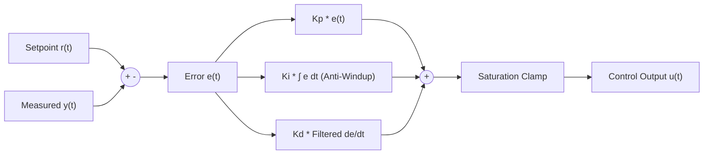

# Closed-Loop PID Controller Skill

Industrial-strength Proportional-Integral-Derivative (PID) controller featuring anti-windup clamping and low-pass derivative filtering.

## Features
- **100% Python Standard Library**: No external dependencies.
- **Anti-Windup Integration**: Halts integrator drift during actuator saturation.
- **First-Order Derivative Filtering**: Suppresses high-frequency sensor noise.
- **MCP Server Ready**: Direct stdio control loop invocation.
